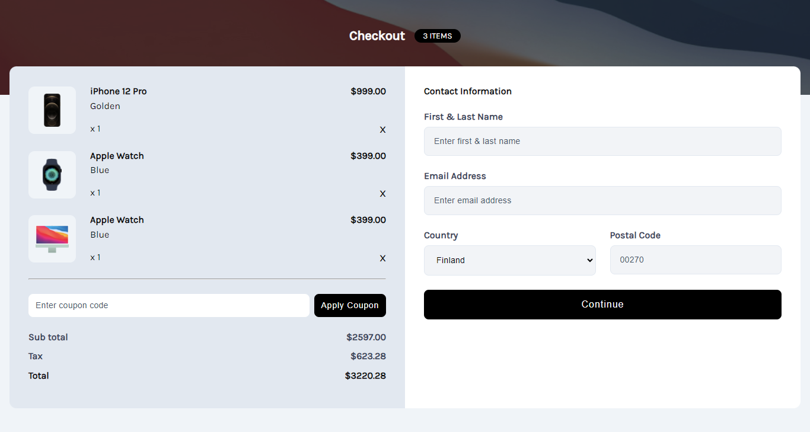

# Devchallenges - Apple-shop-checkout-page-challenge

Solution for a challenge <a href="https://devchallenges.io/challenge/apple-shop-checkout-page-challenge" target="_blank">Device Shop Checkout</a> from <a href="http://devchallenges.io" target="_blank">devChallenges.io</a>.

<!-- TABLE OF CONTENTS -->

## Table of Contents

- [Overview](#overview)
- [Built with](#built-with)
- [Author](#author)

<!-- OVERVIEW -->

## Overview

### Built with

- Semantic HTML5 markup
- CSS custom properties
- Flexbox
- CSS Grid

This application/site was created as a submission to a [DevChallenges](https://devchallenges.io/challenges-dashboard) challenge.

## Author

- Twitter - [Tori Bemide](https://x.com/home)
- GitHub [@your-username](https://github.com/Tori-Bemide)
